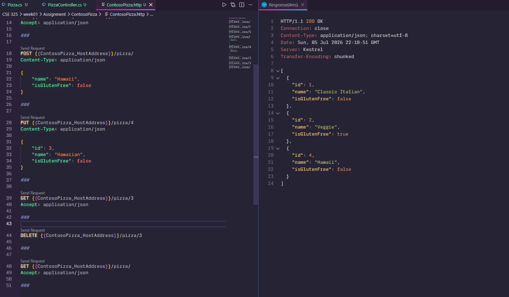

# CSE 325
---

## Week01 Assignment

- Create a web API with ASP.NET Core
  - [Controller](week01/Assignment/ContosoPizza/Controllers/PizzaController.cs)
  - [Model](week01/Assignment/ContosoPizza/Models/Pizza.cs)
  - [Service](week01/Assignment/ContosoPizza/Services/PizzaService.cs)
  - [ContosoPizza.http](week01/Assignment/ContosoPizza/ContosoPizza.http)

- Work with files and directories in a .NET app
  - [Summary Function file](week01/Assignment/mslearn-dotnet-files/salesTotalDir/salesSummary.txt)